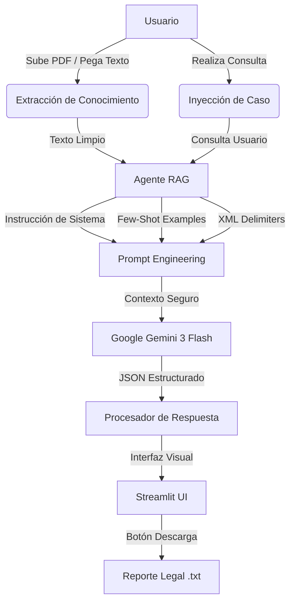

# ⚖️ Asistente Legal Inteligente (RAG)

Este proyecto es un asistente experto diseñado para analizar reglamentos, contratos y leyes utilizando la arquitectura **RAG (Retrieval-Augmented Generation)**. La aplicación permite cargar documentos en formato PDF o texto plano y realizar consultas legales precisas basadas exclusivamente en el conocimiento proporcionado, mitigando alucinaciones y garantizando trazabilidad legal.

**Desarrollado por:**
*   **Viviana García** - [Konrad Lorenz]
*   **Braian Ramirez** - [Konrad Lorenz]

---

## 🏗️ Arquitectura del Sistema (RAG Flow)

El flujo de información garantiza que la inteligencia artificial esté "anclada" (grounded) al documento legal subido:



---

## 🛠️ Tecnologías Utilizadas

*   **Core:** Python 3.9+
*   **IA:** Google Gemini 3 Flash (vía SDK `google-genai`)
*   **Frontend:** Streamlit (Custom CSS para diseño premium)
*   **Documentación:** `pypdf` (Motor de extracción de PDF)
*   **Entorno:** `python-dotenv` para gestión de API Keys seguras.

---

## 🚀 Guía de Instalación y Uso

### 1. Preparación del Entorno
```bash
# Crear entorno virtual
python3 -m venv env
source env/bin/activate  # MacOS/Linux
# .\env\Scripts\activate # Windows

# Instalar dependencias
pip install -r requirements.txt
```

### 2. Configuración
Crea un archivo `.env` en la raíz con tu clave de API:
```env
GEMINI_API_KEY=tu_clave_aqui
```

### 3. Ejecución
```bash
streamlit run app.py
```

---

## 🧠 Ingeniería de Prompts (Requisitos Académicos)

Este sistema implementa las 4 estrategias clave de Prompt Engineering exigidas:

1.  **System Instruction:** Se define una "Identidad de Sistema" que obliga al modelo a actuar como un jurista experto y prohíbe el uso de conocimiento externo al documento.
2.  **Few-Shot Prompting:** Se inyectan ejemplos de entrenamiento rápido en el prompt para asegurar que la IA aprenda el formato de análisis y la estructura JSON en un solo paso.
3.  **Delimitadores XML:** Se utilizan tags `<contexto>` y `<consulta>` para jerarquizar la información y evitar confusiones en el modelo durante el procesamiento de textos largos.
4.  **Structured Output (JSON):** Se fuerza al modelo a responder exclusivamente en JSON técnico (`response_mime_type`), lo que permite que la interfaz muestre alertas de colores y tarjetas de riesgo automáticamente.

---

## 🌟 Características Destacadas (Actualizado)

*   ✅ **Soporte PDF:** Carga de reglamentos directamente desde archivos PDF.
*   ✅ **Diseño Premium:** Interfaz con tarjetas de reporte visuales y colores semánticos (Verde=Válido, Rojo=Inválido).
*   ✅ **Exportación:** Generación automática de reportes de caso en formato texto descargable.
*   ✅ **Seguridad Jurídica:** Clasificación de niveles de riesgo (Bajo, Medio, Alto) en cada análisis.

---

## 📝 Notas de Versión
*   **v1.0 (Avance 1):** Implementación de arquitectura RAG, motor de PDF y técnica de Few-Shot.
*   **Modelo optimizado:** `gemini-3-flash-preview` para velocidad y precisión en recuperación de datos.

---
© 2026 - Proyecto Académico Konrad Lorenz
